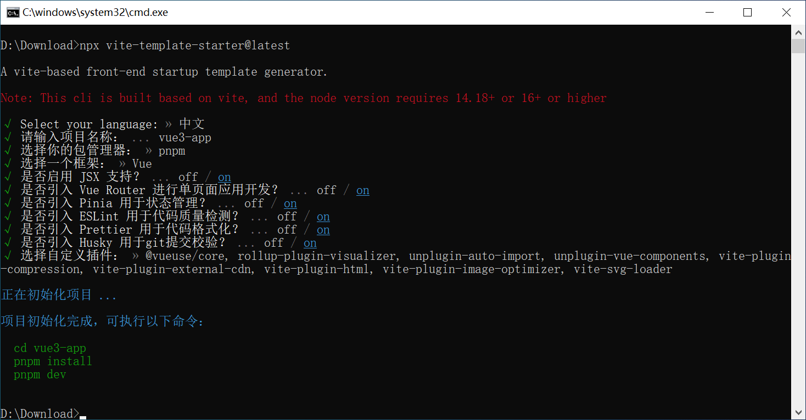

# vite-template-starter

A vite-based front-end startup template generator.



## Usage

To create a new project using vite-template-starter, simply run the following command in your terminal:

```shell
npx vite-template-starter@latest
```

> [!NOTE]
> (`@latest` or `@legacy`) MUST NOT be omitted, otherwise `npm` may resolve to a cached and outdated version of the package.

## Step

- Step1 Select your language.

```text
√ Select your language:
>   EN
>   中文
```  

- Step2 Select dependency to add the project.

```text
√ Project name: >> vite-starter
√ Select your packageManager:
>   npm
>   yarn
>   pnpm
√ Select a framework:
>   vue
>   react
√ Add JSX Support? ... off / on
√ Add Vue Router for Single Page Application development? ... off / on
√ Add Pinia for state management? ... off / on
√ Add ESLint for code quality? ... off / on
√ Add Prettier for code formatting? ... off / on
√ Add Husky for git hooks? ... off / on
```

- Step3 Select vite plugin.

```text
√ Select custom plugins:
( )     @vueuse/core
( )     rollup-plugin-visualizer
( )     unplugin-auto-import
( )     unplugin-vue-components
( )     vite-plugin-compression
( )     vite-plugin-external-cdn
( )     vite-plugin-html
( )     vite-plugin-image-optimizer
( )     vite-svg-loader
```
